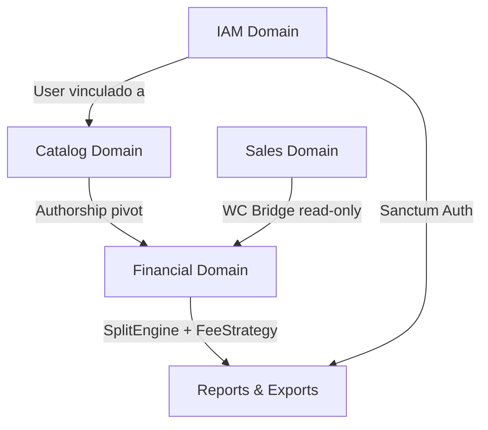
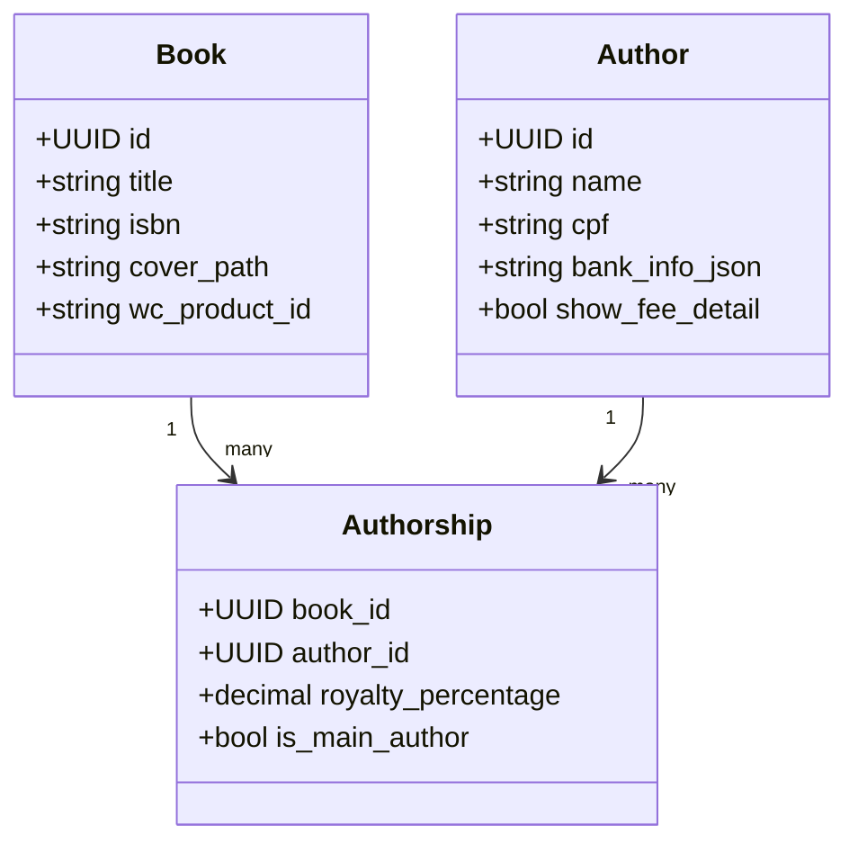
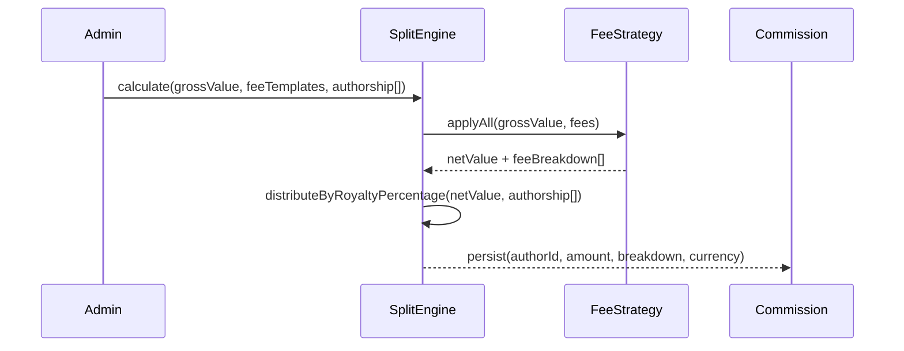
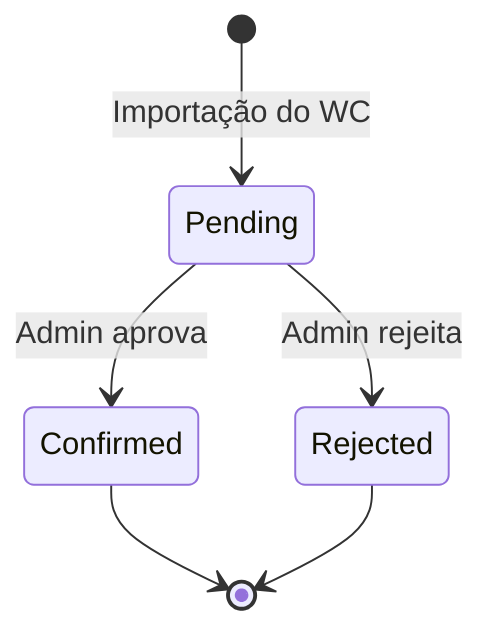

# SUGAR — Arquitetura Mestre e Especificação de Domínio

# SUGAR — Sistema Unificado de Gestão de Autores e Royalties

## 1. Visão Geral

O SUGAR é uma plataforma financeira e de transparência construída em **Laravel 11** (backend/API) + **React** (frontend SPA), que consome dados brutos de um banco WooCommerce (read-only) e os transforma em relatórios de auditoria, cálculo de splits e dashboards para autores e administradores.

## 2. Stack Tecnológica

| Camada | Tecnologia |
| --- | --- |
| Backend | Laravel 11, PHP 8.3+ |
| Frontend | React 18 + TypeScript + Vite |
| Autenticação | Laravel Sanctum (SPA) |
| Banco Principal | MySQL 8 (banco SUGAR) |
| Banco Externo | MySQL 8 (banco WooCommerce — read-only) |
| Storage | Local / AWS S3 (capas de livros) |
| Exports | Laravel Excel (CSV) + DomPDF (PDF) |
| Filas | Laravel Queue (jobs de importação WC) |

## 3. Arquitetura de Domínio (DDD)



### Estrutura de Pastas

```
app/
├── Domain/
│   ├── Authors/
│   │   ├── Entities/Author.php
│   │   ├── Repositories/AuthorRepository.php
│   │   └── Services/AuthorService.php
│   ├── Books/
│   │   ├── Entities/Book.php
│   │   ├── Entities/Authorship.php
│   │   └── Services/BookService.php
│   └── Financial/
│       ├── SplitEngine.php
│       ├── FeeStrategy.php
│       ├── FeeTemplate.php
│       └── ExchangeService.php
├── Application/
│   ├── Providers/
│   │   └── SecondaryDatabaseProvider.php
│   └── Webhooks/
│       └── IuguWebhookHandler.php
└── Infrastructure/
    ├── Persistence/          ← Eloquent Models (banco SUGAR)
    │   ├── UserModel.php
    │   ├── AuthorModel.php
    │   ├── BookModel.php
    │   └── CommissionModel.php
    └── External/             ← Eloquent Models (banco WooCommerce)
        ├── WcOrderModel.php
        ├── WcOrderItemModel.php
        └── WcAbandonedCartModel.php
```

## 4. Domínio de Identidade (IAM)

### Entidades

| Campo | Tipo | Descrição |
| --- | --- | --- |
| `users.id` | UUID | PK |
| `users.name` | string | Nome de login |
| `users.email` | string unique | Email |
| `users.role` | enum: `admin`, `author` | Papel no sistema |
| `users.author_id` | FK nullable | Vínculo com entidade Author |

### Fluxos

- **Login**: Sanctum SPA — emite cookie de sessão.
- **Password Recovery**: Email com link assinado (Laravel built-in).
- **Author Link**: Admin vincula um `User` a um `Author` via painel.

## 5. Domínio de Catálogo (Catalog)

### Entidades



- **`show_fee_detail`**: flag por autor — controla se o autor vê o detalhamento das taxas deduzidas nos relatórios.
- **`wc_product_id`**: referência ao produto no WooCommerce para cruzamento de dados.
- **Cover Upload**: endpoint dedicado que armazena a capa localmente ou em S3, independente do WordPress.

## 6. Domínio Financeiro — O Coração do SUGAR

### 6.1 FeeTemplate & FeeStrategy

| Campo | Tipo | Descrição |
| --- | --- | --- |
| `fee_templates.id` | UUID | PK |
| `fee_templates.name` | string | Ex: "Taxa Iugu", "Marketing" |
| `fee_templates.type` | enum: `percentage`, `fixed` | Tipo de cálculo |
| `fee_templates.value` | decimal | Valor ou percentual |
| `fee_templates.visible_to_author` | bool | Exibir ao autor? |
| `fee_templates.currency` | enum: `BRL`, `USD` | Moeda da taxa |

### 6.2 SplitEngine



- Recebe o valor bruto de uma venda.
- Aplica cada `FeeStrategy` em cascata (percentual ou fixo).
- Distribui o valor líquido entre os autores conforme `royalty_percentage` na tabela `Authorship`.
- Persiste o resultado como `Commission` com status `pending`.

### 6.3 Multi-Currency

| Campo | Tipo | Descrição |
| --- | --- | --- |
| `exchange_rates.id` | UUID | PK |
| `exchange_rates.from_currency` | string | Ex: USD |
| `exchange_rates.to_currency` | string | Ex: BRL |
| `exchange_rates.rate` | decimal(10,6) | Taxa de câmbio |
| `exchange_rates.source` | enum: `manual`, `api` | Origem da taxa |
| `exchange_rates.api_url` | string nullable | URL da API de câmbio |
| `exchange_rates.fetched_at` | timestamp | Última atualização |

- Admin pode inserir taxa manualmente **ou** configurar uma URL de API externa.
- `ExchangeService` consulta a URL configurada e persiste a taxa automaticamente via job agendado.

## 7. Domínio de Vendas (Sales/External)

### 7.1 WC Bridge (Read-Only)

- Conexão separada configurada em `config/database.php` como `woocommerce`.
- Models em `Infrastructure/External/` usam `protected $connection = 'woocommerce'`.
- **Nenhuma escrita** é feita no banco WooCommerce.

### 7.2 Comissões



| Campo | Tipo | Descrição |
| --- | --- | --- |
| `commissions.id` | UUID | PK |
| `commissions.wc_order_id` | string | Referência ao pedido WC |
| `commissions.author_id` | UUID FK | Autor beneficiário |
| `commissions.book_id` | UUID FK | Livro vendido |
| `commissions.gross_amount` | decimal | Valor bruto |
| `commissions.net_amount` | decimal | Valor líquido após taxas |
| `commissions.currency` | string | BRL / USD |
| `commissions.fee_breakdown` | JSON | Detalhamento das taxas |
| `commissions.status` | enum | `pending`, `confirmed`, `rejected` |

### 7.3 Abandoned Cart Dashboard

- Lê a tabela de carrinhos abandonados do WooCommerce (ex: plugin WooCommerce Abandoned Cart).
- Exibe para o Admin: cliente, itens, valor, data de abandono.
- Sem ação de escrita — apenas visualização.

## 8. Relatórios e Exports

### Filtros Cruzados

| Filtro | Campo |
| --- | --- |
| Período | `commissions.created_at` (range) |
| Autor | `commissions.author_id` |
| Livro | `commissions.book_id` |
| ID da Venda | `commissions.wc_order_id` |

### Transparência por Autor

- Se `authors.show_fee_detail = true`: o relatório do autor exibe o `fee_breakdown` completo.
- Se `false`: o autor vê apenas o valor líquido final.

### Exports

- **CSV**: via `maatwebsite/excel` — exportação assíncrona via job para arquivos grandes.
- **PDF**: via `barryvdh/laravel-dompdf` — template Blade renderizado server-side.

## 9. Wireframes Principais

### 9.1 Dashboard do Admin

```wireframe

<html>
<head>
<style>
* { box-sizing: border-box; margin: 0; padding: 0; font-family: sans-serif; font-size: 13px; }
body { background: #f4f6f9; display: flex; height: 100vh; }
.sidebar { width: 200px; background: #1e2a3a; color: #ccc; padding: 16px; flex-shrink: 0; }
.sidebar h2 { color: #fff; font-size: 16px; margin-bottom: 24px; }
.sidebar a { display: block; padding: 8px 0; color: #aaa; text-decoration: none; border-bottom: 1px solid #2e3d50; }
.sidebar a.active { color: #fff; font-weight: bold; }
.main { flex: 1; padding: 24px; overflow-y: auto; }
.topbar { display: flex; justify-content: space-between; align-items: center; margin-bottom: 20px; }
.topbar h1 { font-size: 18px; color: #1e2a3a; }
.cards { display: grid; grid-template-columns: repeat(4, 1fr); gap: 16px; margin-bottom: 24px; }
.card { background: #fff; border-radius: 6px; padding: 16px; border-left: 4px solid #3b82f6; }
.card .label { color: #888; font-size: 11px; text-transform: uppercase; margin-bottom: 6px; }
.card .value { font-size: 22px; font-weight: bold; color: #1e2a3a; }
.section { background: #fff; border-radius: 6px; padding: 16px; margin-bottom: 16px; }
.section h3 { font-size: 14px; margin-bottom: 12px; color: #1e2a3a; border-bottom: 1px solid #eee; padding-bottom: 8px; }
.filters { display: flex; gap: 8px; margin-bottom: 12px; flex-wrap: wrap; }
.filters input, .filters select { border: 1px solid #ddd; border-radius: 4px; padding: 6px 10px; font-size: 12px; }
.filters button { background: #3b82f6; color: #fff; border: none; border-radius: 4px; padding: 6px 14px; cursor: pointer; }
table { width: 100%; border-collapse: collapse; font-size: 12px; }
th { background: #f8f9fa; text-align: left; padding: 8px; color: #555; border-bottom: 2px solid #eee; }
td { padding: 8px; border-bottom: 1px solid #f0f0f0; color: #333; }
.badge { display: inline-block; padding: 2px 8px; border-radius: 10px; font-size: 11px; }
.badge.pending { background: #fef3c7; color: #92400e; }
.badge.confirmed { background: #d1fae5; color: #065f46; }
.badge.rejected { background: #fee2e2; color: #991b1b; }
.actions { display: flex; gap: 4px; }
.btn-sm { padding: 3px 8px; border-radius: 3px; border: none; cursor: pointer; font-size: 11px; }
.btn-confirm { background: #10b981; color: #fff; }
.btn-reject { background: #ef4444; color: #fff; }
</style>
</head>
<body>
<div class="sidebar">
  <h2>🍯 SUGAR</h2>
  <a href="#" class="active">Dashboard</a>
  <a href="#">Comissões</a>
  <a href="#">Autores</a>
  <a href="#">Livros</a>
  <a href="#">Taxas (Fees)</a>
  <a href="#">Câmbio</a>
  <a href="#">Carrinhos Abandonados</a>
  <a href="#">Relatórios</a>
  <a href="#">Usuários</a>
</div>
<div class="main">
  <div class="topbar">
    <h1>Dashboard Administrativo</h1>
    <span style="color:#888">Admin · admin@sugar.com</span>
  </div>
  <div class="cards">
    <div class="card">
      <div class="label">Vendas (mês)</div>
      <div class="value">R$ 48.320</div>
    </div>
    <div class="card" style="border-color:#10b981">
      <div class="label">Comissões Confirmadas</div>
      <div class="value">142</div>
    </div>
    <div class="card" style="border-color:#f59e0b">
      <div class="label">Pendentes de Aprovação</div>
      <div class="value">23</div>
    </div>
    <div class="card" style="border-color:#8b5cf6">
      <div class="label">Carrinhos Abandonados</div>
      <div class="value">17</div>
    </div>
  </div>
  <div class="section">
    <h3>Comissões Pendentes de Aprovação</h3>
    <div class="filters">
      <input type="date" placeholder="De" data-element-id="filter-date-from" />
      <input type="date" placeholder="Até" data-element-id="filter-date-to" />
      <select data-element-id="filter-author"><option>Todos os Autores</option><option>João Silva</option></select>
      <select data-element-id="filter-book"><option>Todos os Livros</option><option>O Caminho</option></select>
      <input type="text" placeholder="ID do Pedido WC" data-element-id="filter-order-id" style="width:140px" />
      <button data-element-id="btn-filter">Filtrar</button>
    </div>
    <table>
      <thead>
        <tr><th>Pedido WC</th><th>Autor</th><th>Livro</th><th>Bruto</th><th>Líquido</th><th>Moeda</th><th>Status</th><th>Ações</th></tr>
      </thead>
      <tbody>
        <tr>
          <td>#10045</td><td>João Silva</td><td>O Caminho</td><td>R$ 89,90</td><td>R$ 67,43</td><td>BRL</td>
          <td><span class="badge pending">Pendente</span></td>
          <td class="actions"><button class="btn-sm btn-confirm" data-element-id="btn-confirm-1">Confirmar</button><button class="btn-sm btn-reject" data-element-id="btn-reject-1">Rejeitar</button></td>
        </tr>
        <tr>
          <td>#10046</td><td>Maria Souza</td><td>Luz Interior</td><td>R$ 59,90</td><td>R$ 44,93</td><td>BRL</td>
          <td><span class="badge pending">Pendente</span></td>
          <td class="actions"><button class="btn-sm btn-confirm" data-element-id="btn-confirm-2">Confirmar</button><button class="btn-sm btn-reject" data-element-id="btn-reject-2">Rejeitar</button></td>
        </tr>
        <tr>
          <td>#10047</td><td>João Silva</td><td>O Caminho</td><td>$ 12,00</td><td>$ 9,00</td><td>USD</td>
          <td><span class="badge confirmed">Confirmado</span></td>
          <td class="actions"><button class="btn-sm" style="background:#ddd" data-element-id="btn-view-3">Ver</button></td>
        </tr>
      </tbody>
    </table>
  </div>
</div>
</body>
</html>
```

### 9.2 Portal do Autor

```wireframe

<html>
<head>
<style>
* { box-sizing: border-box; margin: 0; padding: 0; font-family: sans-serif; font-size: 13px; }
body { background: #f4f6f9; display: flex; height: 100vh; }
.sidebar { width: 200px; background: #1e2a3a; color: #ccc; padding: 16px; flex-shrink: 0; }
.sidebar h2 { color: #fff; font-size: 16px; margin-bottom: 24px; }
.sidebar a { display: block; padding: 8px 0; color: #aaa; text-decoration: none; border-bottom: 1px solid #2e3d50; }
.sidebar a.active { color: #fff; font-weight: bold; }
.main { flex: 1; padding: 24px; overflow-y: auto; }
.topbar { display: flex; justify-content: space-between; align-items: center; margin-bottom: 20px; }
.topbar h1 { font-size: 18px; color: #1e2a3a; }
.cards { display: grid; grid-template-columns: repeat(3, 1fr); gap: 16px; margin-bottom: 24px; }
.card { background: #fff; border-radius: 6px; padding: 16px; border-left: 4px solid #3b82f6; }
.card .label { color: #888; font-size: 11px; text-transform: uppercase; margin-bottom: 6px; }
.card .value { font-size: 22px; font-weight: bold; color: #1e2a3a; }
.section { background: #fff; border-radius: 6px; padding: 16px; margin-bottom: 16px; }
.section h3 { font-size: 14px; margin-bottom: 12px; color: #1e2a3a; border-bottom: 1px solid #eee; padding-bottom: 8px; }
.filters { display: flex; gap: 8px; margin-bottom: 12px; }
.filters input, .filters select { border: 1px solid #ddd; border-radius: 4px; padding: 6px 10px; font-size: 12px; }
.filters button { background: #3b82f6; color: #fff; border: none; border-radius: 4px; padding: 6px 14px; cursor: pointer; }
.export-btns { display: flex; gap: 8px; margin-bottom: 12px; }
.export-btns button { border: 1px solid #ddd; background: #fff; border-radius: 4px; padding: 5px 12px; cursor: pointer; font-size: 12px; }
table { width: 100%; border-collapse: collapse; font-size: 12px; }
th { background: #f8f9fa; text-align: left; padding: 8px; color: #555; border-bottom: 2px solid #eee; }
td { padding: 8px; border-bottom: 1px solid #f0f0f0; color: #333; }
.badge { display: inline-block; padding: 2px 8px; border-radius: 10px; font-size: 11px; }
.badge.confirmed { background: #d1fae5; color: #065f46; }
.fee-detail { font-size: 11px; color: #888; }
</style>
</head>
<body>
<div class="sidebar">
  <h2>🍯 SUGAR</h2>
  <a href="#" class="active">Meus Royalties</a>
  <a href="#">Meus Livros</a>
  <a href="#">Relatórios</a>
  <a href="#">Meu Perfil</a>
</div>
<div class="main">
  <div class="topbar">
    <h1>Meus Royalties</h1>
    <span style="color:#888">João Silva</span>
  </div>
  <div class="cards">
    <div class="card">
      <div class="label">Total Confirmado (mês)</div>
      <div class="value">R$ 1.243,50</div>
    </div>
    <div class="card" style="border-color:#f59e0b">
      <div class="label">Pendente de Confirmação</div>
      <div class="value">R$ 312,00</div>
    </div>
    <div class="card" style="border-color:#10b981">
      <div class="label">Livros Ativos</div>
      <div class="value">3</div>
    </div>
  </div>
  <div class="section">
    <h3>Extrato de Comissões</h3>
    <div class="filters">
      <input type="date" data-element-id="author-filter-from" />
      <input type="date" data-element-id="author-filter-to" />
      <select data-element-id="author-filter-book"><option>Todos os Livros</option><option>O Caminho</option></select>
      <button data-element-id="author-btn-filter">Filtrar</button>
    </div>
    <div class="export-btns">
      <button data-element-id="btn-export-csv">⬇ Exportar CSV</button>
      <button data-element-id="btn-export-pdf">⬇ Exportar PDF</button>
    </div>
    <table>
      <thead>
        <tr><th>Pedido WC</th><th>Livro</th><th>Bruto</th><th>Taxas</th><th>Líquido (sua parte)</th><th>Status</th></tr>
      </thead>
      <tbody>
        <tr>
          <td>#10045</td><td>O Caminho</td><td>R$ 89,90</td>
          <td class="fee-detail">Iugu: R$ 8,99<br>Marketing: R$ 4,50<br>Logística: R$ 8,98</td>
          <td><strong>R$ 67,43</strong></td>
          <td><span class="badge confirmed">Confirmado</span></td>
        </tr>
        <tr>
          <td>#10046</td><td>O Caminho</td><td>R$ 59,90</td>
          <td class="fee-detail">Iugu: R$ 5,99<br>Marketing: R$ 3,00<br>Logística: R$ 5,98</td>
          <td><strong>R$ 44,93</strong></td>
          <td><span class="badge confirmed">Confirmado</span></td>
        </tr>
      </tbody>
    </table>
  </div>
</div>
</body>
</html>
```

## 10. Configuração de Banco de Dados Duplo

Em `config/database.php`, duas conexões são definidas:

- **`mysql`** (padrão) → banco SUGAR (leitura e escrita).
- **`woocommerce`** → banco WooCommerce (somente leitura, credenciais via `.env`).

Variáveis de ambiente necessárias:

```
DB_CONNECTION=mysql
DB_HOST=...  DB_DATABASE=sugar  DB_USERNAME=...  DB_PASSWORD=...

WC_DB_HOST=...  WC_DB_DATABASE=wordpress  WC_DB_USERNAME=...  WC_DB_PASSWORD=...
WC_DB_PREFIX=wp_
```

## 11. Segurança e Permissões

| Recurso | Admin | Author |
| --- | --- | --- |
| Aprovar/Rejeitar Comissão | ✅ | ❌ |
| Ver fee_breakdown completo | ✅ | Condicional (`show_fee_detail`) |
| Gerenciar FeeTemplates | ✅ | ❌ |
| Ver carrinhos abandonados | ✅ | ❌ |
| Exportar relatórios | ✅ | ✅ (próprios dados) |
| Configurar câmbio | ✅ | ❌ |

Middleware de autorização via **Laravel Policies** por recurso.
